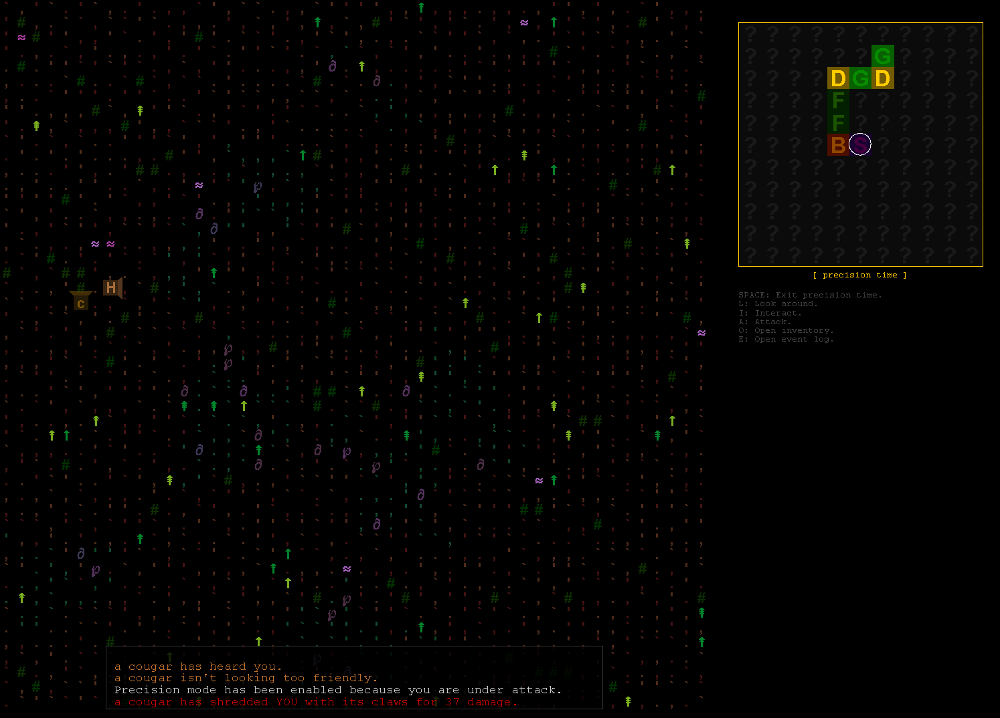

# coinage

> This is a legacy project I created back in 2015. Looking back over it now, there's a lot that I would do differently. For starters: not write it in Java 😅. Still, there's some neat ideas here buried amongst the boilerplate.

An open-world roguelike-like largely inspired by Dwarf Fortress's Adventure Mode. Built in Java, it features a hierarchical world structure, procedural generation, and a tactical actor-controller system.

### Features

*   **Open-World Exploration**: Navigate a large world divided into fixed-screen areas, similar to Caves of Qud.
*   **Procedural Generation**: Worlds are generated using a blueprint system with patch-based biome distribution.
*   **Dwarf Fortress Inspired**: Focuses on a detailed simulation of actors and their environment.
*   **Tactical Gameplay**: Dynamic turn-based action with a focus on timing, positioning, attributes, and equipment.
*   **Entity-Controller Architecture**: Separation between physical entities (`Actor`) and their logic (`Controller`/`Agent`).

### Architecture Overview

The project is organized into several key modules:

*   **`Actor`**: Defines entities within the game. Includes attributes (Muscle, Grit, Reflex, etc.), stats (Health, Damage types), and inventory.
*   **`Thing`**: Items, weapons, and objects that populate the world.
*   **`World`**: Handles the hierarchical world structure.
    *   `World`: The global container for all areas.
    *   `Area`: A specific region (e.g., 48x48 squares) with a specific biome.
    *   `Square`: The individual tiles containing terrain and physical objects.
    *   `Blueprint`: Used for high-level world generation planning.
*   **`Controller`**: Contains the logic for actor behavior.
    *   `PlayerAgent`: Bridges user input to player actions.
    *   `AiActorAgent`: Handles NPC behavior using routines (Wander, Fight, Investigate).
    *   `Action`: Encapsulates discrete actions like `Moving`, `Attacking`, and `Equipping`.
*   **`Game`**: The core engine and loop.
    *   `GameEngine`: Manages the main game loop.
    *   `GameDisplay`: Handles rendering and visual output.
    *   `GameInput`: Interprets keyboard commands.

### Getting Started

#### Prerequisites
*   Java JDK 8 or higher.

#### Running the Game
The main entry point is located at:
`src/game/io/GameLoader.java`

You can run this file directly from your IDE to start the game.

### Development

*   **Resources**: The game loads data from resource files in the `raw/` folder.
*   **World Gen**: Adjust generation parameters in `WorldFactory.java` to change world scale and patchiness.

### License

This project is licensed under the MIT License. See the [LICENSE](LICENSE) file for details.